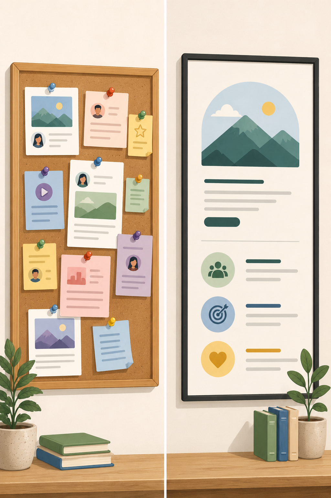

:: title ::
# What is a blog?

:: content ::

	<BackPack :size="140" mood="blissful" color="#EA5347" />
	<SpeechBubble position="l" color="cyan" shape="round" maxWidth="500px">
		Tiny websites with big personalities
		Today we explore what blogs are, why they matter, and how they work inside a CMS like WordPress.
		No code — just concepts, examples, and smart questions.
	</SpeechBubble>

---
title: What do you thing a blog is?
layout: top-title
color: indigo
---

::title::
# What do you think a blog is?

::content::

	<StickyNote textAlign="center" title="A diary?" customTitle="text-2xl" style="display: flex; align-items: center; justify-content: center; font-weight: bold;"></StickyNote>
	<StickyNote textAlign="center" title="A company news page?" customTitle="text-2xl" style="display: flex; align-items: center; justify-content: center; font-weight: bold;"></StickyNote>
	<StickyNote textAlign="center" title="A personal brand machine?" customTitle="text-2xl" style="display: flex; align-items: center; justify-content: center; font-weight: bold;"></StickyNote>
	<StickyNote textAlign="center" title="A tutorial collection?" customTitle="text-2xl" style="display: flex; align-items: center; justify-content: center; font-weight: bold;"></StickyNote>

	<BackPack :size="140" mood="blissful" color="#EA5347" />
	<SpeechBubble position="l" color="cyan" shape="round" maxWidth="300px" style="margin-top: 33px;">
	Yes. Often all of the above.
	</SpeechBubble>

<!--
A blog is…

A blog is a regularly updated collection of posts, usually shown in reverse chronological order.

That means the newest post appears first.

Blogs are often written in a more personal, direct, or timely style than traditional web pages.

They are used to share ideas, knowledge, stories, updates, opinions, inspiration, and expertise.
-->

---
title: Meaning
layout: top-title
color: indigo
---

::title::
# Blog = web + log

::content::
The word “blog” comes from weblog.

Originally, blogs were like online journals or link collections.

Today, blogs can be part of almost any digital communication strategy:

* personal portfolios
* company websites
* magazines
* educational platforms
* product updates
* niche communities

---
title: Not just random writing
layout: top-title
color: indigo
---

::title::
# Blogs are not just “random writing”

::content::
## A good blog usually has:

* a clear topic or purpose
* an audience in mind
* posts published over time
* categories or tags
* a recognizable voice
* a way for readers to continue exploring

A blog is both content and structure.

---
layout: top-title-two-cols
color: indigo
background: "data:image/jpeg;base64,/9j/4AAQSkZJRgABAQ..."
columns: is-5
---

::title::
# Blog posts vs. pages

::left::

## Blog posts
* timely -> often have a date
* part of a feed
* often have date and author
* can be categorized and tagged
* usually invite browsing

## Pages
* more permanent
* not usually part of a feed
* explain stable information
* examples: About, Contact, Services
* often sit in the navigation menu

::right::

<!--
Think of it like this:
A page is like a poster on the wall.

A blog post is like a new message on the notice board.

The poster stays mostly the same.

The notice board keeps growing.

Both can be useful — but they do different jobs.
-->

---
layout: top-title
color: indigo
---

::title::
# Why blogs matter in WordPress

::content::
WordPress began as a blogging platform. That means blog thinking is built into its DNA:

* posts
* authors
* dates
* categories
* tags
* comments
* archives
* feeds

Even when WordPress is used for full websites, blogs are still one of its core strengths.

---
title: Different types of blogs
layout: top-title
color: indigo
---

::title::
# Different types of blogs

::content::
Blogs can take many forms - for example:

	<StickyNote textAlign="center" title="personal blogs" customTitle="text-2xl" style="display: flex; align-items: center; justify-content: center; font-weight: bold;"></StickyNote>
	<StickyNote textAlign="center" title="company blogs" customTitle="text-2xl" style="display: flex; align-items: center; justify-content: center; font-weight: bold;"></StickyNote>
	<StickyNote textAlign="center" title="news blogs" customTitle="text-2xl" style="display: flex; align-items: center; justify-content: center; font-weight: bold;"></StickyNote>
	<StickyNote textAlign="center" title="educational blogs?" customTitle="text-2xl" style="display: flex; align-items: center; justify-content: center; font-weight: bold;"></StickyNote>

	<StickyNote textAlign="center" title="portfolio blogs" customTitle="text-2xl" style="display: flex; align-items: center; justify-content: center; font-weight: bold;"></StickyNote>
	<StickyNote textAlign="center" title="review blogs" customTitle="text-2xl" style="display: flex; align-items: center; justify-content: center; font-weight: bold;"></StickyNote>
	<StickyNote textAlign="center" title="niche expert blogs" customTitle="text-2xl" style="display: flex; align-items: center; justify-content: center; font-weight: bold;"></StickyNote>
	<StickyNote textAlign="center" title="campaign blogs" customTitle="text-2xl" style="display: flex; align-items: center; justify-content: center; font-weight: bold;"></StickyNote>

---
layout: top-title
color: indigo
---

::title::
# Trustworthyness

::content::
A blog can build trust when it shows:

* useful knowledge
* real examples
* consistency
* transparency
* good structure
* credible sources
* clear authorship

	<BackPack :size="140" mood="happy" color="#EA5347" />
	<SpeechBubble position="l" color="cyan" shape="round" maxWidth="300px" style="margin-top: 3px;">
	Trust is not created by publishing once. It is built post by post. It's a continuous progress.
	</SpeechBubble>

---